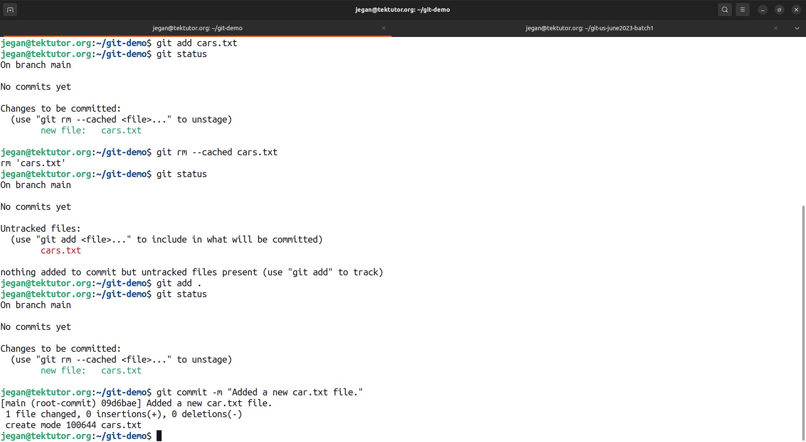

# Day 1

## 📌 Installing Git in Windows
<pre>
https://gitforwindows.org/
</pre>

## 📌 Installing Git in Ubuntu Linux Distribution
<pre>
sudo add-apt-repository ppa:git-core/ppa 
sudo apt update
sudo apt install git
</pre>

## 📌 Installing Git in RedHat Family Linux Distributions
```
sudo yum install -y epel-release && sudo yum -y install git
sudo dnf install git
```

## Check your git version
```
git --version
```

## 🔖 How to clone this repository from Git Bash CLI ?
```
cd ~
git clone https://github.com/tektutor/git-us-june2023-batch1.git
cd git-us-june2023-batch1
```

## Types of Version Control System 
1. Local Version Control System (LVCS)
2. Centralized Version Control System (CVCS)
3. Distributed Version Control System (DVCS)


#### Local Version Control System

#### Centralized Version Control System (CVCS)
- follows client/server architecture
- Example
  - Perforce
  - p4/p4v client tool
  - perforce server tool
- Advantages
  - multi-user, hence all team members would be collaborate
- Disadvantages
  - doesn't support working offline
 
#### Distributed Version Control System (DVCS)
- Example
  - Git/GitHub
- Git Overview
  - opensource tool developed by Linus Torvalds
- Advantages
  - multi-user
  - can work offline unlike CVCS(eg: Perforce)


# Git Commands

## Checking version
```
git --version
```

##  ⛹️ Lab - Perform some basic git configurations
```
git config --global user.name "Jeganathan Swaminathan"
git config --global user.email "mail2jegan@gmail.com"
git config --global core.editor vim
```

Expected output
<pre>
jegan@tektutor.org:~$ mkdir -p git-demo
jegan@tektutor.org:~$ cd git-demo
jegan@tektutor.org:~/git-demo$ ls

jegan@tektutor.org:~/git-demo$ git config --global user.name "Jeganathan Swaminathan"
jegan@tektutor.org:~/git-demo$ git config --global user.email "mail2jegan@gmail.com"

jegan@tektutor.org:~/git-demo$ git config --global --list
credential.helper=cache --timeout=9999999999
pull.rebase=false
core.editor=vim
user.name=Jeganathan Swaminathan
user.email=mail2jegan@gmail.com
init.defaultbranch=main
</pre>


## ⛹️ Lab - Creating a local Git repository
```
cd ~
mkdir -p git-demo
cd git-demo
git init

git config --local user.name "Nitesh Jeganathan"
git config --local user.email "mail2nitesh@gmail.com"
```

Expected output

## ⛹️ Lab - Removing global configurations
The global git configurations are stored under user home .gitconfig file

```
git config --unset --global user.email
git config --unset --global user.name
```

Expected output
<pre>
jegan@tektutor.org:~/git-demo$ git config --list
credential.helper=cache --timeout=9999999999
user.email=mail2jegan@gmail.com
pull.rebase=false
core.editor=vim
core.repositoryformatversion=0
core.filemode=true
core.bare=false
core.logallrefupdates=true

jegan@tektutor.org:~/git-demo$ git config --unset --global user.email
jegan@tektutor.org:~/git-demo$ git config --list
credential.helper=cache --timeout=9999999999
pull.rebase=false
core.editor=vim
core.repositoryformatversion=0
core.filemode=true
core.bare=false
core.logallrefupdates=true
</pre>

## ⛹️ Lab - Staging a file and committing it into the local Git repo
```
cd ~
cd git-demo
git status
touch cars.txt
git status
git add cars.txt
git status
git commit -m "Added cars.txt new file into the local git repo."
```

Expected output
<pre>
jegan@tektutor.org:~/git-demo$ git status
On branch main

No commits yet

nothing to commit (create/copy files and use "git add" to track)
jegan@tektutor.org:~/git-demo$ ls
jegan@tektutor.org:~/git-demo$ ls -lha
total 12K
drwxrwxr-x  3 jegan jegan 4.0K Jun 21 05:04 .
drwxr-x--- 39 jegan jegan 4.0K Jun 21 05:06 ..
drwxrwxr-x  7 jegan jegan 4.0K Jun 21 05:07 .git
jegan@tektutor.org:~/git-demo$ touch cars.txt
jegan@tektutor.org:~/git-demo$ ls -l
total 0
-rw-rw-r-- 1 jegan jegan 0 Jun 21 05:07 cars.txt
jegan@tektutor.org:~/git-demo$ git status
On branch main

No commits yet

Untracked files:
  (use "git add <file>..." to include in what will be committed)
	cars.txt

nothing added to commit but untracked files present (use "git add" to track)
jegan@tektutor.org:~/git-demo$ git add cars.txt 
jegan@tektutor.org:~/git-demo$ git status
On branch main

No commits yet

Changes to be committed:
  (use "git rm --cached <file>..." to unstage)
	new file:   cars.txt

jegan@tektutor.org:~/git-demo$ git rm --cached cars.txt 
rm 'cars.txt'
jegan@tektutor.org:~/git-demo$ git status
On branch main

No commits yet

Untracked files:
  (use "git add <file>..." to include in what will be committed)
	cars.txt

nothing added to commit but untracked files present (use "git add" to track)
jegan@tektutor.org:~/git-demo$ git add .
jegan@tektutor.org:~/git-demo$ git status
On branch main

No commits yet

Changes to be committed:
  (use "git rm --cached <file>..." to unstage)
	new file:   cars.txt

jegan@tektutor.org:~/git-demo$ git commit -m "Added a new car.txt file."
[main (root-commit) 09d6bae] Added a new car.txt file.
 1 file changed, 0 insertions(+), 0 deletions(-)
 create mode 100644 cars.txt
</pre>


## Lab - Checking logs
```
cd ~/git-demo
git log
```

Expected output
<pre>
jegan@tektutor.org:~/git-demo$ git log
commit 09d6bae4e29de0bd7ac95a727a37a3056fb1d0d2 (HEAD -> main)
Author: Nitesh Jeganathan <mail2nitesh@gmail.com>
Date:   Wed Jun 21 05:17:12 2023 +0530

    Added a new car.txt file.
</pre>

## Lab - Attaching a tag to every commit id
```
cd ~/git-demo
git log
git tag v0.1 09d6bae4e29de0bd7ac95a727a37a3056fb1d0d2
git tag v0.2 760466f6e6b430fa7761ad3e422e7365c9a44b40
git log
```

Expected output
<pre>
jegan@tektutor.org:~/git-demo$ git log
commit 760466f6e6b430fa7761ad3e422e7365c9a44b40 (HEAD -> main)
Author: Nitesh Jeganathan <mail2nitesh@gmail.com>
Date:   Wed Jun 21 06:05:43 2023 +0530

    Added BMW X1 to cars.txt

commit 09d6bae4e29de0bd7ac95a727a37a3056fb1d0d2 (tag: v0.1)
Author: Nitesh Jeganathan <mail2nitesh@gmail.com>
Date:   Wed Jun 21 05:17:12 2023 +0530

    Added a new car.txt file.
jegan@tektutor.org:~/git-demo$ git tag v0.2 760466f6e6b430fa7761ad3e422e7365c9a44b40
jegan@tektutor.org:~/git-demo$ git log
commit 760466f6e6b430fa7761ad3e422e7365c9a44b40 (HEAD -> main, tag: v0.2)
Author: Nitesh Jeganathan <mail2nitesh@gmail.com>
Date:   Wed Jun 21 06:05:43 2023 +0530

    Added BMW X1 to cars.txt

commit 09d6bae4e29de0bd7ac95a727a37a3056fb1d0d2 (tag: v0.1)
Author: Nitesh Jeganathan <mail2nitesh@gmail.com>
Date:   Wed Jun 21 05:17:12 2023 +0530

    Added a new car.txt file.
</pre>
